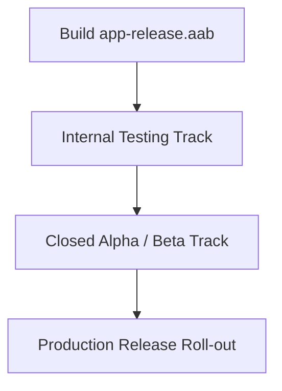

# Kamma Voice — Google Play Store Release & Setup Guide

This guide describes how to compile, sign, verify, and publish the Kamma Voice Android application to the Google Play Store.

---

## 1. Firebase Cloud Messaging Setup (Push Notifications)

To enable breaking news alerts and notifications in the production Android app:

1. Create a project in the [Firebase Console](https://console.firebase.google.com/).
2. Add an Android app with package name `com.kammavoice.app`.
3. Download the generated `google-services.json` file.
4. Place it in `android/app/google-services.json` (this file is referenced inside Gradle builds and will activate the FCM native plugin automatically).

---

## 2. Release Keystore Generation

You must sign your application with a release keystore before uploading it to the Google Play Console. If you do not have one, generate it using the JDK `keytool` command.

### Run Keystore Generation Command:
```bash
keytool -genkeypair -v -storetype JKS -keyalg RSA -keysize 2048 -validity 10000 \
  -storepass SECURE_STORE_PASSWORD \
  -keypass SECURE_KEY_PASSWORD \
  -alias kammavoice \
  -keystore kammavoice-release.keystore \
  -dname "CN=Kamma Voice, OU=Engineering, O=Kamma Voice Media, L=Vijayawada, ST=Andhra Pradesh, C=IN"
```

> [!WARNING]
> Keep `kammavoice-release.keystore` secure. If you lose the keystore or forget the passwords, you will be unable to update the application in the future. Back it up securely.

---

## 3. Configured Build Environment (`local.properties`)

To ensure gradle can automatically compile and sign the release build without hardcoding credentials in git:

1. Create a file named `android/local.properties` (this is ignored in `.gitignore`).
2. Add the following lines to define the signing credentials and Android SDK location:

```properties
sdk.dir=C\:\\Users\\your_user\\AppData\\Local\\Android\\Sdk

# Absolute path to the keystore file (use forward slashes for Windows paths)
RELEASE_STORE_FILE=C:/Users/your_user/certs/kammavoice-release.keystore
RELEASE_STORE_PASSWORD=SECURE_STORE_PASSWORD
RELEASE_KEY_ALIAS=kammavoice
RELEASE_KEY_PASSWORD=SECURE_KEY_PASSWORD
```

When you run the build command, Gradle will read these values and automatically inject them into the release signing block.

---

## 4. Compiling the Production App Bundle (.aab)

Google Play requires the **Android App Bundle (.aab)** format instead of APKs for release publishing.

### Build the Signed AAB:
```bash
# Navigate to the Android project root
cd android

# Build production bundle
./gradlew bundleRelease
```

Once completed, the release-ready signed bundle will be generated at:
`android/app/build/outputs/bundle/release/app-release.aab`

---

## 5. Google Play Console Listing Configuration

### 1. Store Presence & Setup
- **App Name**: Kamma Voice
- **App Type**: App
- **Free/Paid**: Free
- **Category**: News & Magazines
- **Content Rating**: Everyone
- **Themed Icons**: Supported natively (Monochrome adaptive launcher icon configuration enabled for Android 13+).

### 2. Privacy Policy Compliance
You must supply a valid URL to the Privacy Policy. We have built a compliant public privacy policy route:
- **Privacy Policy URL**: `https://kammavoicemmag.vercel.app/privacy`

### 3. Store Listing Assets
Prepare the following graphic assets to complete the store page:
* **App Icon**: 512x512 PNG, Max 1MB.
* **Feature Graphic**: 1024x500 PNG, Max 1500KB (luxurious gold and dark accents branding recommended).
* **Phone Screenshots**: Minimum 2 screenshots, 16:9 or 9:16 aspect ratio, between 320px and 3840px per side.
* **Tablet Screenshots**: Optional but recommended for magazine reader visibility on larger screens.

---

## 6. Deployment Pipelines (Play Store Tracks)

It is highly recommended to roll out the app through the following staging tracks in the Play Console:



1. **Internal Testing**: Upload `app-release.aab` to Internal Testing. Allows up to 100 internal testers to verify installation and loading immediately (usually available within minutes).
2. **Closed Testing (Alpha/Beta)**: Verify compatibility across multiple Android devices and SDK levels.
3. **Production**: Promote the build to Production for public rollout. Use percentage roll-out (e.g., 10%, 25%, 50%, 100%) to monitor initial user telemetry and crashes.
